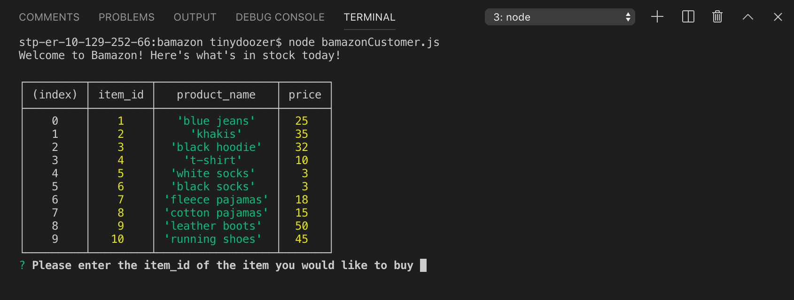
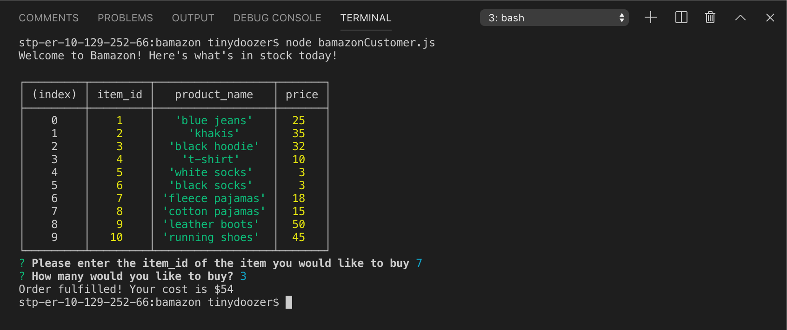
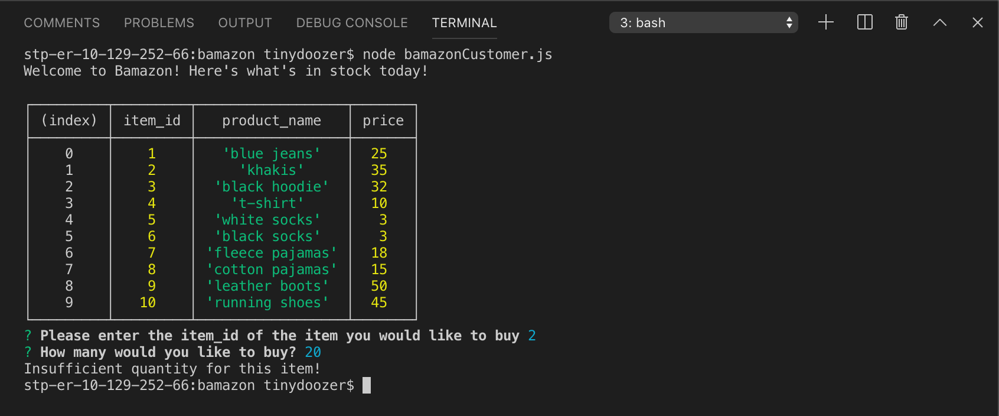

# bamazon

Bamazon is an Amazon-like storefront that takes in orders from customers, checks to see if there's enough stock in the database, and if so, fulfills the order. If not, the customer gets an "insufficient quantity" message and starts over. 

As this is a command line interface app, it's not deployed to GitHub pages, but you can view some screenshots below to get an idea of how it works.

After entering "node bamazonCustomer.js" on the command line, a table of the available items for sale will be displayed. This is pulled from a MySQL database.

The user is prompted to enter the item ID of the product they would like to buy, as well as the quantity. The desired quantity is compared to the stock quantity and if there's enough, success! Order is fulfilled.

If there's not enough quantity in stock, the user is presented with an insufficient quantity message and must start over.

### NPMs Used

- [MySQL](https://www.npmjs.com/package/mysql)
- [Inquirer](https://www.npmjs.com/package/inquirer)

